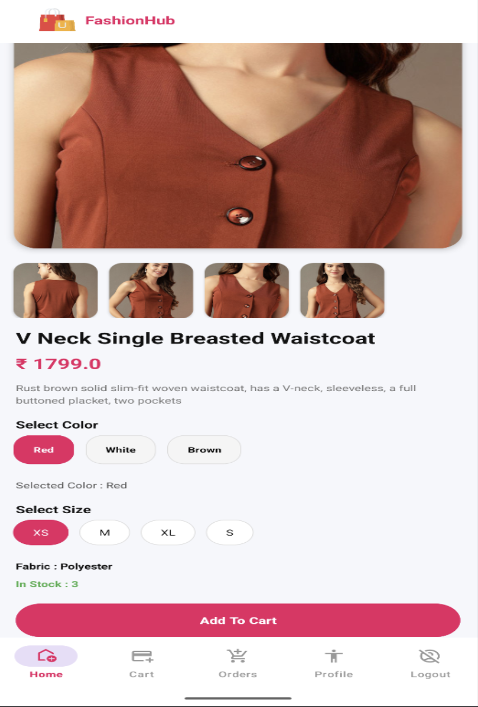
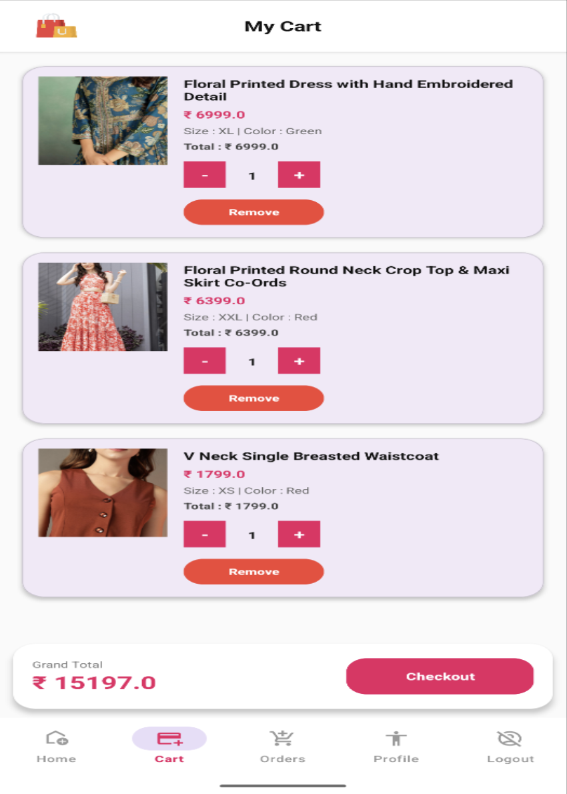
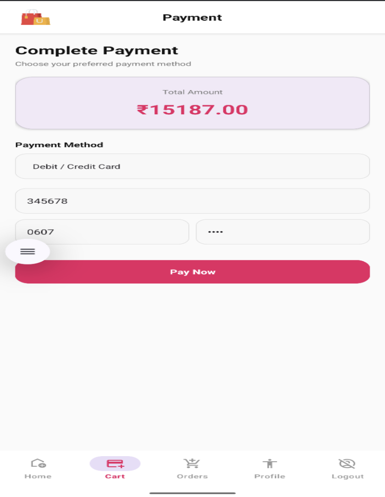

# FashionHub Android App

FashionHub is an Android e-commerce application developed for women's fashion shopping. The application allows users to browse products, view details, add items to cart, and place orders through a modern and user-friendly interface.

## Features

* User Registration & Login
* Browse Fashion Products
* Product Details
* Shopping Cart
* Order Management
* REST API Integration
* Responsive User Interface

## Technologies Used

* Android (Java/Kotlin)
* .NET Web API
* Retrofit
* Glide
* Material Design
* MySQL Database

## Screenshots

### Home Screen

### Product List

### Cart Screen

### Profile Screen

### Order Screen

## Installation

1. Clone the repository
2. Open in Android Studio
3. Sync Gradle
4. Run the application

## Author

Vaishnavi Patel
